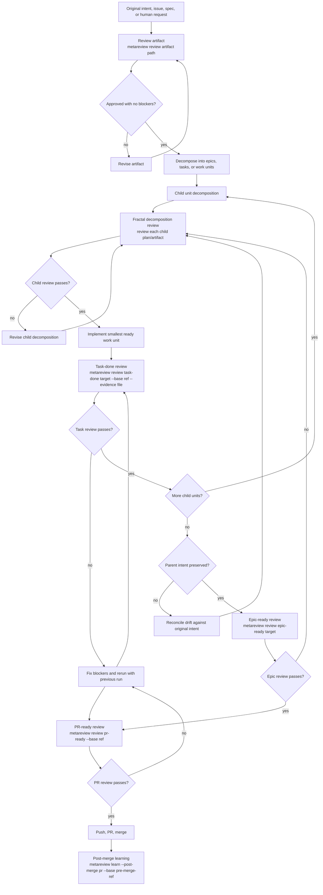

# metareview

Local-first review gates and learning for specs, plans, code, epics, PRs, and post-merge follow-up. Metareview is Go-backed, Markdown-friendly, and designed to run standalone or as a deeper review engine inside metaswarm, Superpowers, and Beads workflows.

## Use Cases

metareview is for any moment where a human or coding agent needs a second, structured pass before moving work forward:

- **Spec review:** check whether requirements are complete, testable, internally consistent, and aligned with the original user intent.
- **Plan review:** challenge implementation plans before work starts, including sequencing, scope control, missing failure paths, and acceptance gates.
- **Architecture review:** evaluate service boundaries, data flow, ownership, coupling, scalability, security, and fit with existing repository patterns.
- **Feasibility review:** identify technical unknowns, external dependencies, risky assumptions, migration hazards, and places where a spike is needed.
- **Decomposition review:** inspect epics, child tasks, dependency graphs, work-unit boundaries, and DoD coverage before agents start executing.
- **Fractal child-plan review:** recursively review decomposed child plans and sub-epics until every level is implementation-ready.
- **Code review:** review local task-sized code chunks before an agent claims done, with repository context and deterministic blocker handling.
- **Test and acceptance review:** verify that tests, acceptance criteria, validation evidence, and edge cases prove the intended behavior.
- **PR readiness review:** check branch-level completeness before push, PR creation, or merge readiness.
- **Intent-drift review:** after iterative revisions, compare the result back to the original request so local fixes do not quietly change the mission.
- **Post-merge learning:** extract durable lessons from merged work, review feedback, failures, and session history into local knowledge.
- **Repository knowledge review:** use service inventories, Beads knowledge, session history, and prior GitHub context to avoid duplicate services and repeated mistakes.

## What Is This?

metareview brings the discipline of structured, adversarial agent workflows to the review side of software development. It gives humans and coding agents repeatable gates for:

- reviewing specs, plans, architecture notes, designs, decompositions, and documentation
- reviewing local task-sized code chunks before an agent claims the task is done
- checking whether an epic or parent task is actually ready after child tasks complete
- checking whether a branch is ready to push, open as a PR, or merge
- extracting post-merge learning into durable local knowledge

On first use in an existing repository, metareview performs the same kind of initial repository analysis that experienced reviewers do manually: it looks for existing architecture notes, service inventories, Beads knowledge, prior sessions, and GitHub history. If no service registry exists, setup can create a metareview-compatible `docs/SERVICE_INVENTORY.md` seed so future reviews have a shared map of important services, ownership boundaries, and repeated code paths.

Unlike proprietary SaaS review products such as CodeRabbit, Greptile, and similar hosted reviewers, metareview keeps this learning local, nonproprietary, and user-readable. Its knowledgebase is Markdown/JSONL-friendly and can be synced through git. Each time review feedback is resolved and work is merged, metareview can incorporate useful lessons, idiosyncratic repository decisions, and reviewer calibration while pruning stale, overly specific, or self-evident entries as the codebase evolves.

The goal is not another loose "please review this" prompt. The goal is a review harness with named gates, explicit evidence, deterministic blocker policy, durable Markdown artifacts, service registry context, and knowledge feedback loops that help future agents avoid repeating mistakes.

## Agentic Review Patterns

metareview is built around review patterns that work well when humans and coding agents are collaborating:

- **Adversarial multi-agent reviews:** run independent reviewer lenses such as architecture, code quality, security, test adequacy, product/user impact, and acceptance completeness against the same artifact or diff.
- **Iterations with hard gates:** treat critical, high, and spec-contract findings as blockers; revise the work and re-run review with `--previous-run <run-id>` until blockers are cleared.
- **Fractal review loops:** decompose large work into epics, tasks, and child plans, then review each level before implementation proceeds.
- **Cross-level intent checks:** after multiple revision loops, compare the accepted child work back to the parent plan and original user request.
- **Evidence-backed reviews:** attach test output, validation commands, acceptance notes, and PR context so reviewers judge the real work product, not a summary.
- **Deterministic local reviewers:** use stable local rules for baseline gates so agents cannot skip known failure modes or bury blockers in prose.
- **Specialist optional reviewers:** bring in business analysts, user advocates, interaction designers, copywriters, SREs, security reviewers, and release engineers when the artifact needs those perspectives.
- **Repository-knowledge priming:** load service inventories, Beads knowledge, session history, and GitHub history so reviewers catch duplicated services, stale assumptions, and prior mistakes.
- **Review artifact accountability:** write durable Markdown context and review logs so future humans and agents can inspect what was reviewed, what blocked, and why it passed.
- **Post-merge reflection:** after a PR lands, extract accepted learnings, discarded candidates, and reviewer calibration so the next review starts smarter.

## Install

### npm Package

```bash
npm install -g metareview
metareview setup --check
```

Packaged releases include a built `bin/metareview` binary. Source checkout mode requires Go 1.22+ and falls back to:

```bash
go run ./cmd/metareview
```

### Codex Plugin

```bash
codex plugin marketplace add dsifry/metareview-marketplace
codex
```

Then open `/plugins`, select the metareview marketplace, and install `metareview`. Codex invokes metareview skills with `$setup`, `$review-task-done`, `$review-epic-ready`, `$review-pr-ready`, `$review-artifact`, `$learn-post-merge`, and `$status`.

For local development from a checkout:

```bash
codex plugin marketplace add /path/to/metareview
codex
```

### Claude Code Plugin

```bash
claude plugin marketplace add dsifry/metareview-marketplace
claude plugin install metareview
```

Claude Code invokes metareview through `/setup`, `/review-task-done`, `/review-epic-ready`, `/review-pr-ready`, `/review-artifact`, `/learn-post-merge`, and `/status`.

### Source Checkout

```bash
git clone https://github.com/dsifry/metareview.git
cd metareview
npm install
npm run build
./bin/metareview setup --check
```

See [INSTALL.md](INSTALL.md), [docs/README.codex.md](docs/README.codex.md), and [docs/README.claude.md](docs/README.claude.md) for details.

## Works even better with metaswarm!

[metaswarm](https://github.com/dsifry/metaswarm) is a multi-agent orchestration framework for Claude Code, Codex CLI, and Gemini CLI. It coordinates specialized agent roles, Beads-backed task graphs, Superpowers workflows, adversarial design and plan review gates, TDD-oriented work-unit execution, PR shepherding, and post-merge learning across a full software development lifecycle.

metareview is useful on its own, but it is designed to be strongest when installed alongside [metaswarm](https://github.com/dsifry/metaswarm), Superpowers, and Beads.

Use metaswarm as the lifecycle owner: issue intake, decomposition, Beads task graph, Superpowers planning/TDD workflows, orchestration, PR shepherding, and post-merge closure. Use metareview as the deeper review harness at the points where work quality is decided:

- artifact review before a spec, plan, or decomposition becomes implementation input
- task-done review after each work unit or small local chunk
- epic-ready review when child tasks are complete and the parent is ready to land
- pr-ready review before push, PR creation, or merge readiness
- post-merge learning after the PR is confirmed merged

In a repository that already has metaswarm/Superpowers/Beads, run:

```bash
metareview setup --check
```

Expected mode is `metaswarm-extension`. In that mode, metareview should extend metaswarm's review framework, not overwrite metaswarm files or take ownership of Beads task state.

## How The Workflow Works



The decomposition loop is intentionally fractal: a parent plan can be decomposed into child epics, each child can be decomposed again, and each level gets reviewed before implementation continues. After the iteration converges, metareview checks back against the original parent intent so accumulated local fixes do not quietly drift away from the user request.

Every review produces Markdown artifacts under `docs/metareview/` and local transient state under `.metareview/`. A blocking finding is current work. A `NOT_REVIEWED` artifact scaffold is also current work, not a pass. Fix it, re-run with `--previous-run <run-id>`, and do not claim completion until the review reports `PASS` or `PASS_ADVISORY` with zero blockers.

## How Humans Use It

Humans use metareview to make review timing explicit:

```bash
metareview review artifact docs/spec.md
metareview review task-done docs/tasks/task-001.md --base main --evidence /tmp/evidence.txt
metareview review epic-ready docs/epics/epic-001.md
metareview review pr-ready --base main
metareview learn --post-merge 42 --base pre-merge-sha
```

Use the smallest gate that matches the decision you are making. If you are deciding whether a plan is good enough, use `artifact`; the default command creates a `NOT_REVIEWED` scaffold and exits nonzero until the required reviewer rows and final verdict are completed. Use `--scaffold-only` only for explicit scaffold generation. If you are deciding whether a task is done, use `task-done`. If you are deciding whether a branch is ready, use `pr-ready`.

## How Coding Agents Use It

Coding agents should treat metareview as a completion gate, not an optional commentary tool:

- Before implementation, review the artifact that defines the work.
- After each local task-sized code change, run `task-done` with the exact base ref and evidence file.
- After child tasks complete, run `epic-ready` before landing the parent.
- Before push, PR creation, or merge, run `pr-ready`.
- After merge, run `learn --post-merge` so repository knowledge improves.

Agents must not say work is done while a blocking finding remains unresolved. They should commit durable review/context artifacts when the repository's artifact policy says to do so, and keep transient `.metareview/findings.jsonl` and `.metareview/runs.jsonl` local.

## Core Commands

```bash
metareview setup --check
metareview setup --bootstrap-prereqs --dry-run
metareview review artifact <path>
metareview review task-done <task-id-or-path> --base <base-ref> --evidence <file>
metareview review epic-ready <epic-id-or-path>
metareview review pr-ready --base <base-ref>
metareview learn --post-merge <pr-number> --base <pre-merge-ref>
metareview status
```

## Philosophy

metareview follows a few practical rules:

1. Review early enough that the agent still has context.
2. Review against written intent, not vibes.
3. Separate advisory notes from blockers.
4. Preserve evidence in Markdown so humans can inspect it.
5. Keep transient state local and durable learning git-native.
6. Re-check original intent after iterative revisions so the work does not drift.
7. Prefer local, repo-aware review over remote black-box review when the codebase's tacit knowledge matters.

## More Docs

- [INSTALL.md](INSTALL.md) - installation paths and troubleshooting
- [docs/quickstart.md](docs/quickstart.md) - short operator guide
- [docs/README.codex.md](docs/README.codex.md) - Codex plugin usage
- [docs/README.claude.md](docs/README.claude.md) - Claude Code plugin usage
- [docs/index.html](docs/index.html) - static GitHub Pages entrypoint

## License

MIT. See [LICENSE](LICENSE).
